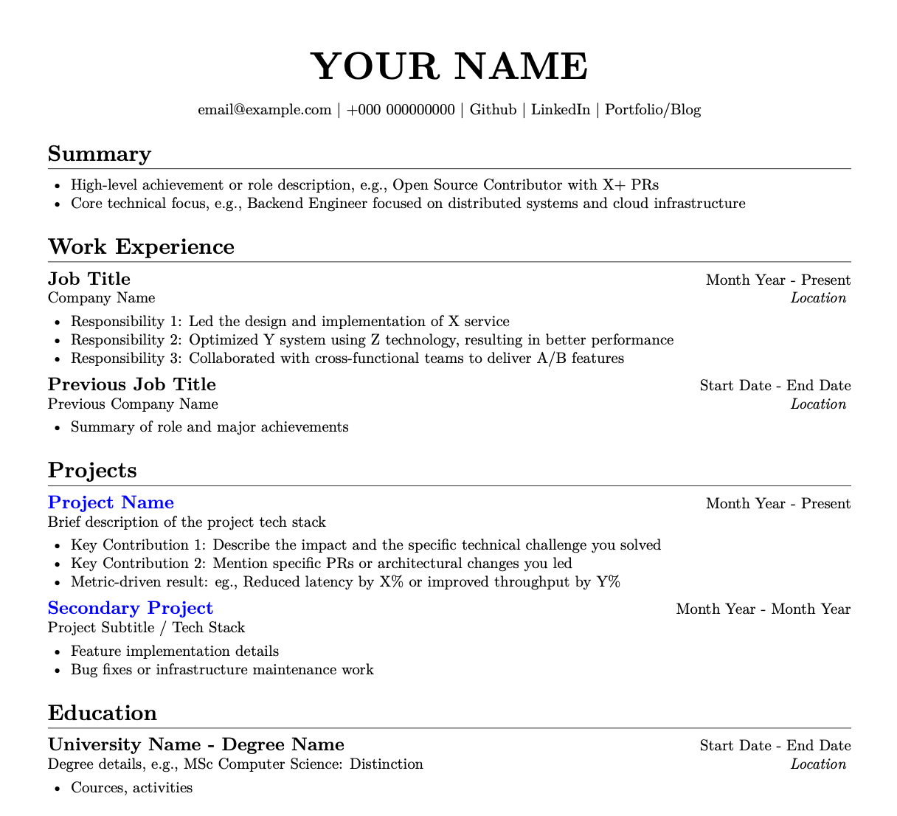

# Quarto Resume

A clean, single-source resume template built with Quarto. Write in Markdown, generate perfectly styled PDF (via LaTeX/Lua) and HTML.

Below is a preview of the generated resume. You can also view the [Source File](./resume.qmd) or the [Full PDF](./_site/resume.pdf).



## Prerequisites

To use this template, you need to have **Quarto** and a **LaTeX** distribution installed.

### 1. Install Quarto
Download and install the latest version from:
[quarto.org/docs/get-started/](https://quarto.org/docs/get-started/)

### 2. Install TinyTeX
Quarto uses TinyTeX for PDF rendering. Run this command to install it:

```sh
quarto install tinytex
```

## Structure

The resume has three main sections:

1. **Title Block** - Name and contact information (links, email, phone)
2. **Summary** - Bullet points highlighting key qualifications
3. **Detail Blocks** - Experience sections with:
   - Title (e.g., position/role)
   - Date (right-aligned)
   - Subtitle/Location (metadata)
   - Bullet points describing responsibilities/achievements

## Usage

### Method 1: Use as a Quarto Template (Recommended)

You can initialize a new project using this template directly via the Quarto CLI. This is the cleanest way to start a new resume:

```sh
quarto use template machichima/quarto-resume-template
```

Note: To make `quarto use template` work seamlessly, ensure you have a `template.qmd` in your root directory (or the directory you specify). Quarto will look for this file to scaffold the user's new project.

### Method 2: Fork and Modify

1. Fork this repository.
2. Clone it to your local machine.
3. Edit `resume.qmd` with your information.

## Workflow

> **Note:** The HTML format is currently experimental. It is highly recommended to preview and render using the **PDF** format for the best layout results.

### Preview

To see changes in real-time while you edit:

```sh
quarto preview resume.qmd --to pdf
```

### Render to PDF

To generate the final version:

```sh
quarto render resume.qmd --to pdf
```

## Syntax Guide

This template uses specific classes to trigger layout logic for PDF and HTML.

### 1. Header & Contact

Use following for the name (title) and contact details.

```markdown
::: {.resume-header .center}
# Your Name
:::

::: {.center data-latex=""}
email@example.com | [Link](...) | [Link](...)
:::
```

### 2. Experience/Project Blocks

**Strict Format Required:** Use `{.experience-block}` on the header, followed immediately by a `{.metadata}` div containing `{.date}`, `{.subtitle}`, and `{.location}` spans.

```markdown
### Job/Project Title {.experience-block}

::: {.metadata}
[Date Range]{.date}

[Company / Subtitle]{.subtitle}

[Location]{.location}
:::

- Bullet point
  - Sub-bullet

```

## Configuration Files

| File | Purpose |
| --- | --- |
| `resume.qmd` | Main content (Markdown) and basic PDF/HTML options (margins, fonts). |
| `resume-header.tex` | **LaTeX Styling.** Handles headers, bullet points, spacing, and font styles for the PDF. |
| `resume-filter.lua` | **PDF Layout.** A script that automatically aligns dates to the right and titles to the left. |
| `styles.css` | **HTML Layout.** Handles the Web version layout using CSS Flexbox. |

## Customization

* **Fonts & Margins:** Edit `fontsize` and `geometry` in the YAML header of `resume.qmd`.
* **Bullet Points:** Modify `\setlist[itemize]` in `resume-header.tex` to change symbols or indentation.
* **Spacing & Headers:** Adjust `\titlespacing` and `\titleformat` in `resume-header.tex` to change the gaps between sections or the look of section titles.
* **HTML Styling:** Edit `styles.css` to change how the web version looks.
